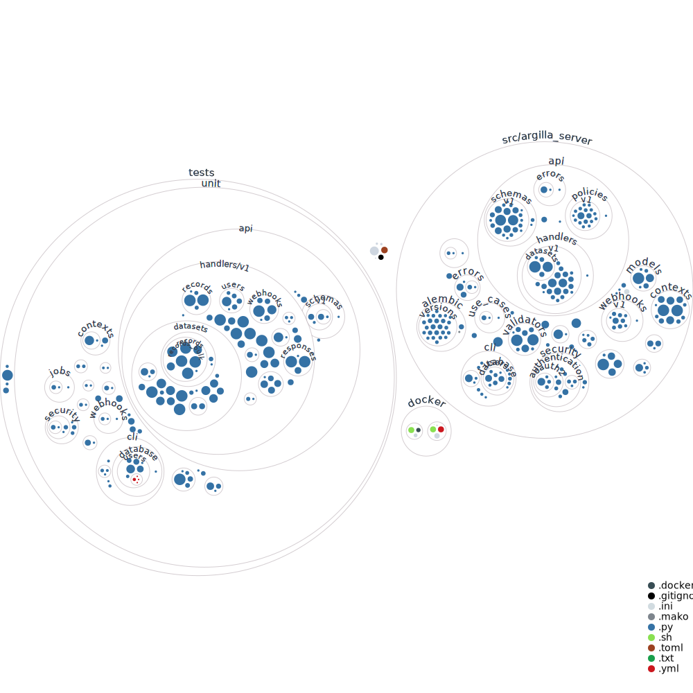
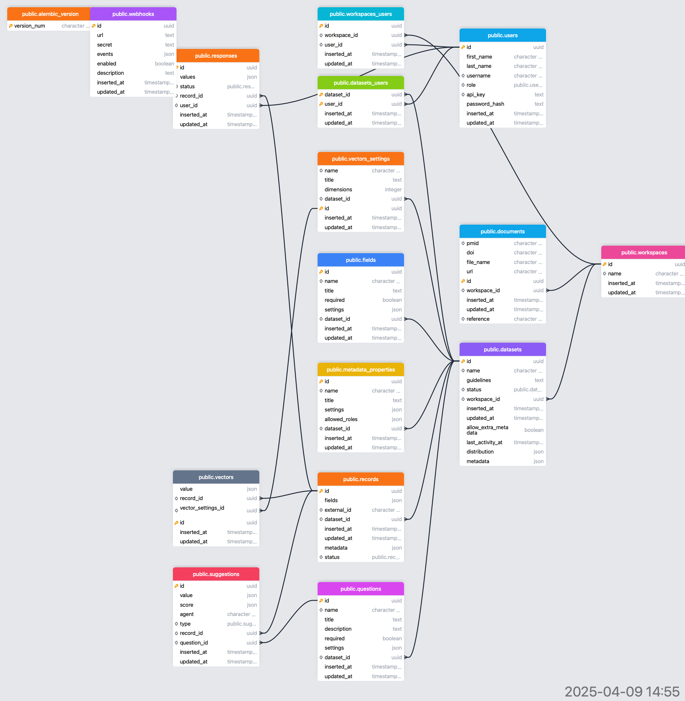

# Developer Guide

As an Extralit developer, you are already part of the community, and your contribution is valuable to our development. This guide will help you set up your development environment and start contributing.

!!! note "Extralit core components"

    - **Mkdocs Documentation**: Extralit's documentation serves as an invaluable resource, providing a comprehensive and in-depth guide for both annotators and project admins to explore, understand, and effectively use the core components of the Extralit ecosystem.

    - **Vue.js Web UI**: A web application to visualize, extract and validate your data, users, and teams. It is built with `Vue.js` and `Nuxt.js` and is directly deployed alongside the Extralit Server within our Extralit Docker image.

    - **Python SDK**: A Python SDK installable with `pip install extralit` to interact with the Extralit Server and the Extralit UI. It provides an API as well as a CLI to manage the data, configuration, and extraction workflows.

    - **FastAPI Server**: The core of Extralit's back-end is a Python `FastAPI server` that manages the document extraction and data annotation lifecycle, as well as serving the Nuxt-built Web UI. It does so by interfacing with the relational database, text-search/vector database, file blob storage, and redis. It provides an REST API that interacts with the data from the Python SDK and the Extralit UI. It also provides a web interface to visualize the data.

    - **Relational Database**: A relational database to store the data of the records, workspaces, and users. `PostgreSQL` is the preferred database option for persistent deployments, otherwise `sqlite` can also be used for certain local development scenarios, such as testing or lightweight, single-user setups.

    - **File Blob Storage**: A file storage system to store the documents and files associated with the records. It can be a local file system or a cloud-based storage solution like `Minio` or `Amazon S3`. For local development, we use a local file system or self-hosted Minio, while for production deployments, we recommend using S3.

    - **Text Search Database**: An indexed text search database to enable efficient searching and retrieval of data records. We currently support `Elasticsearch` for this purpose, which allows for full-text search capabilities and is integrated with the Extralit Server. When deployed in initiation, Elasticsearch copies and indexes all of the records data from the Relational Database.

    - **RAG Vector Database**: A vector database to store the document content and perform scalable vector similarity searches, supporting RAG uses for LLM extraction. We currently support `Weaviate` but soon will add support to "Elasticsearch" to consolidate the dependencies.


## Environment setup

[:octicons-tools-16: Development Environment Setup Guide](../getting_started/development_setup.md){.md-button}

This guide covers everything you need to get started, including:

- Installing prerequisites
- Setting up Docker containers
- Configuring your development environment
- Running Extralit components locally

Once you have your environment set up, you can return to this guide to learn more about the specific components you want to contribute to.

## The Extralit repository

The Extralit repository has a monorepo structure, which means that all the components are located in the same repository: [`extralit/extralit`](https://github.com/extralit/extralit). This repo is divided into the following folders:

- [`argilla/src/extralit/`](https://github.com/extralit/extralit/tree/develop/argilla/src/extralit): The FastAPI server project for extraction
- [`argilla/docs/`](https://github.com/extralit/extralit/tree/develop/argilla/docs): The documentation project
- [`argilla/src/argilla/`](https://github.com/extralit/extralit/tree/develop/argilla): The argilla SDK project
- [`argilla-server/src/argilla_server/`](https://github.com/extralit/extralit/tree/develop/argilla-server): The FastAPI server project for annotation
- [`argilla-frontend/`](https://github.com/extralit/extralit/tree/develop/argilla-frontend): The Vue.js UI project
- [`examples`](https://github.com/extralit/extralit/tree/develop/examples): Example resources for deployments, scripts and notebooks

!!! note "How to contribute?"
    Before starting to develop, we recommend reading our [contribution guide](contributor.md) to understand the contribution process and the guidelines to follow. Once you have [cloned the Extralit repository](contributor.md#fork-the-extralit-repository) and [checked out to the correct branch](contributor.md#create-a-new-branch), you can start setting up your development environment.

??? example "Argilla Directory Structure"
    

??? example "Argilla Server Directory Structure"
    

## Development workflow

[:octicons-rocket-16: How to Create a New Release](release_guide.md){.md-button}

If you prefer not to use Codespaces, you can set up your development environment manually using the following approaches.

### Set up the Python environment

To work on the Extralit Python SDK, you must install the Extralit package on your system.

!!! tip "Create a virtual environment"
    We recommend creating a dedicated virtual environment for SDK development to prevent conflicts. For this, you can use the manager of your choice, such as `venv`, `micromamba`, `pyenv`, or `uv`.

From the root of the cloned Extralit repository.

```sh
cd extralit
```

Next, activate your virtual Python environment and make the required installations:

```sh
# Install the `pdm` package manager
pip install pdm

# Install extralit in editable mode and the development dependencies
pdm install --dev
```

To install specific sub-packages with editable mode, you can use the following command:

```sh
pip install -e argilla/
# or
pip install -e argilla-server/
```


### Linting and formatting

To maintain a consistent code format, install the `pre-commit` hooks to run before each commit automatically.

```sh
pre-commit install
# then
pre-commit run
```

These commit hooks will automated linting and formatting checks

### Write clear commit messages

!!! note "Commit message format"
    When writing commit messages, follow this structure:

        short one line title

        Longer description of what the change does (if the title isn't enough).

        An explanation of why the change is being made.

        Perhaps a discussion of context and/or alternatives that were
        considered.

This format helps document the code, keeps the commit history clean, and makes it easier to understand changes. Tools like GitLens will display these messages directly on code lines, improving collaboration.


### Running tests

Running tests at the end of every development cycle is indispensable to ensure no breaking changes. GH Actions Workflows automatically run the tests on every commit and PR, but you can also run them locally.

```sh
# Run all tests
pdm run tests

# Run specific tests
pytest tests/integration
pytest tests/unit
```

??? tip "Running linting, formatting, and tests"
    You can run all the checks at once by using the following command:

    ```sh
        pdm run all
    ```

## Set up the documentation

Documentation is essential to provide users with a comprehensive guide about Extralit.

!!! note "From `main` or `develop`?"
    If you are updating, improving, or fixing the current documentation without a code change, work on the `main` branch. For new features or bug fixes that require documentation, use the `develop` branch.

To contribute to the documentation and generate it locally, ensure you installed the development dependencies as shown in the ["Set up the Python environment"](#set-up-the-python-environment) section, and run the following command to create the development server with `mkdocs`:

```sh
mkdocs serve
```

### Documentation guidelines

As mentioned, we use [`mkdocs`](https://www.mkdocs.org/) to build the documentation. You can write the documentation in [`markdown`](https://www.markdownguide.org/getting-started/) format, and it will automatically be converted to HTML. In addition, you can include elements such as tables, tabs, images, and others, as shown in this [guide](https://squidfunk.github.io/mkdocs-material/reference/). We recommend following these guidelines:

- **Use clear and concise language**: Ensure the documentation is easy to understand for all users by using straightforward language and including meaningful examples. Images are not easy to maintain, so use them only when necessary and place them in the appropriate folder within the `docs/assets/images` directory.
- **Verify code snippets**: Double-check that all code snippets are correct and runnable.
- **Review spelling and grammar**: Check the spelling and grammar of the documentation.
- **Update the table of contents**: If you add a new page, include it in the relevant `index.md` or the `mkdocs.yml` file.

!!! note "Contribute with a tutorial"
    You can also contribute a tutorial (`.ipynb`) to the "Community" section. We recommend aligning the tutorial with the structure of the existing tutorials. For an example, check [this tutorial](../tutorials/getting_started.ipynb).

## Set up the databases

Extralit uses a PostgreSQL database to store all application data. Understanding the database schema is essential for developers working on backend components or making changes that affect data storage.



### Working with Database Revisions

When making changes to the database schema, you need to create database revisions using Alembic. This ensures database migrations are tracked and applied consistently across different environments.

#### Creating a New Revision

1. Make your changes to the SQLAlchemy models
2. Generate a new revision file:

```bash
cd argilla-server
PYTHONPATH=. alembic revision --autogenerate -m "Brief description of the change"
```

3. Review the generated revision file in `argilla-server/migrations/versions/`
4. Test the migration:

```bash
# Apply the migration
PYTHONPATH=. alembic upgrade head

# Rollback if needed
PYTHONPATH=. alembic downgrade -1
```

#### Applying Migrations

To apply all pending migrations:

```bash
PYTHONPATH=. alembic upgrade head
```

To check the current database version:

```bash
PYTHONPATH=. alembic current
```

#### Guidelines for Database Changes

- Always create migrations for schema changes
- Test migrations in both directions (upgrade and downgrade)
- Keep migrations backward compatible when possible
- Document complex migrations with comments

!!! warning "Production Databases"
    Be extremely cautious when applying migrations to production databases. Always backup your database before applying migrations and test thoroughly in staging environments first.

### Contributing to the CLI

The Command Line Interface (CLI) is an important part of Extralit that enables users to interact with the platform from their terminal. Here's how to contribute to the CLI:

#### CLI Structure

The CLI code is located in `argilla/src/argilla/cli` with this organization:

```
cli/
├── app.py                # Main entry point
├── command_modules/      # Individual commands
    ├── datasets/         # Dataset operations
    ├── documents/        # Document operations
    ├── extraction/       # Extraction pipeline
    ├── files/            # File operations
    └── ...               # Other commands
```

The CLI uses [Typer](https://typer.tiangolo.com/) for creating the command-line interface.

#### Adding a New CLI Command

1. Create a new module in the appropriate directory:

```python
# src/argilla/cli/mycommand/__main__.py
import typer
from argilla.cli.callback import init_callback
from argilla.cli.rich import get_argilla_themed_panel
from rich.console import Console

app = typer.Typer(help="My command description")

@app.callback()
def callback(ctx: typer.Context):
    """Callback for my command."""
    init_callback()

@app.command(name="subcommand")
def my_subcommand(param: str = typer.Argument(..., help="Parameter description")):
    """Subcommand docstring - appears in help."""
    # Command implementation
    Console().print(f"Executed with parameter: {param}")
```

2. Register your command in `app.py`:

```python
from argilla.cli import mycommand
app.add_typer(mycommand.app, name="mycommand")
```

3. Write tests for your command in `tests/unit/cli/test_mycommand.py`

4. Update the [CLI documentation](../user_guide/command_line_interface.md) with examples

#### CLI Design Principles

- Create commands that fit into existing workflows
- Follow consistent naming and structure patterns
- Provide clear help text for all commands and options, e.g. use the [`print_rich_table`](https://github.com/extralit/extralit/blob/develop/argilla/src/argilla/cli/rich.py#L115) function to print tables in a rich format
- Use sensible defaults to minimize required input
- Follow the Unix philosophy: commands should do one thing well


## Troubleshooting

### Persistent Volume & Storage Classes
When using Kubernetes, persistent volume issues can occur:
- PVs might not be available when services are deployed, especially in `kind` clusters
- PVC might bind to incorrect PVs depending on creation order
- For persistent storage issues, check the `uncategorized` resource in Tilt
- Sometimes clearing `/tmp/kind-volumes/` and restarting the cluster is needed

### Deployment Issues
Common deployment problems:
- `elasticsearch`: Can fail on restart due to data-shard issues
- `main-db` Postgres: May fail to remount volumes after redeployment due to password changes

For support, join the [Extralit Slack channel](https://join.slack.com/t/extralit/shared_invite/zt-32blg3602-0m0XewPBXF7776BQ3m7ZlA).

